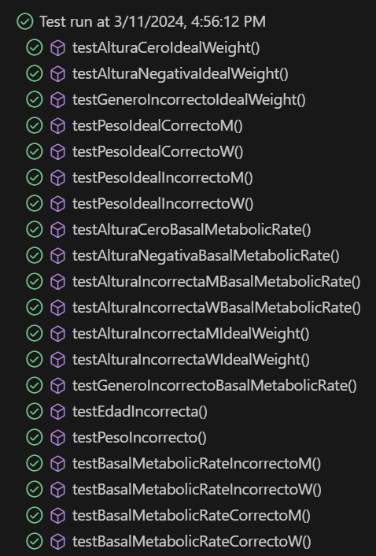
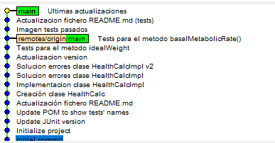
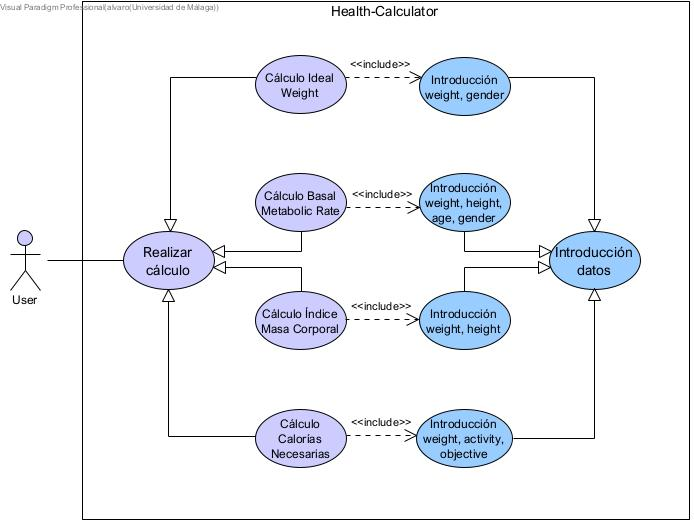

# Health Calculator - Ingenieria del Software Avanzada

Este es el primer proyecto para la asignatura de 'Ingenieria del Software' para el curso 2024.

Este proyecto consiste en desarrollar una calculadora que permita estimar varios parámetros de salud de una persona, como por ejemplo su peso ideal o su tasa metabólica basal (TMB).

- [Práctica 1: Implementación y Tests](#práctica-1-implementación-y-tests)
- [Práctica 2: Casos de Uso](#práctica-2-casos-de-uso)

## Práctica 1: Implementación y Tests {#seccion1}

Tests Ideal Weight

### Test método **HealthCalc.idealWeigth()**

1. **Test de Altura Cero** `testAlturaCeroIdealWeight` 

En este test se verifica que el sistema ofrece una excepción cuando la altura indicada por el usuario es 0. Este caso sería invalido ya que no tiene lógica para nuestro ejercicio.

2. **Test de Altura Negativa** `testAlturaNegativaIdealWeight` 

En este test se comprueba que, al ofrecer el usuario una altura < 0, es decir negativa, el programa lo reconoce y devuelve la excepción correspondiente.
Este caso sería invalido ya que no se contempla una altura negativa en ningún caso.

3. **Test de Altura Incorrecta Hombre** `testAlturaIncorrectaMdealWeight`

En este test se verifica que la entrada para el valor altura es incorrecta, entendiendo esto como una altura no contemplada en nuestros parámetros.
Hemos tomado como altura incorrecta para un hombre una altura de 250 cm.

4. **Test de Altura Incorrecta Mujer** `testAlturaIncorrectaWIdealWeight`

En este test se verifica que la entrada para el valor altura es incorrecta, entendiendo esto como una altura no contemplada en nuestros parámetros.
Hemos tomado como altura incorrecta para una mujer una altura de 230 cm.

5. **Test de Género Incorrecto** `testGeneroIncorrectoIdealWeight`

En este test se asegura que el sistema rechaza una entrada para la variable 'género' distinta de 'M'(Man/Hombre) o 'W'(Woman/Mujer).
Este caso sería invalido para nuestro proyecto particular.

6. **Test de Peso Ideal Incorrecto Hombre** `testPesoIdealIncorrectoM`

En este test se comprueba que, si el sistema devuelve un peso ideal incorrecto para un hombre, esto se detecta como un error y se lanza una excepción.
Entendemos como ***peso ideal incorrecto*** aquel que devuelva un valor negativo, lo cual no se contempla en nuestro proyecto.
Entendemos como ***error*** dos casos, el primero puede deberse a un error en el algoritmo empleado para calcular el peso ideal, y el otro es debido a una entrada incorrecta de los datos, lo que puede llevar en ambos casos a un peso ideal incorrecto.

7. **Test de Peso Ideal Incorrecto Mujer** `testPesoIdealIncorrectoW`

Este test es muy similar al anterior, pero para una mujer. Su funcionamiento es el mismo, pero hay que tener en cuenta diferentes criterios, ya que dependiendo del género seleccionado, la fórmula para calcular el peso ideal varía en sus parámetros. 

8. **Test de Peso Ideal Correcto Hombre** `testPesoIdealCorrectoM` 

En este test se comprueba ahora sí, el correcto funcionamiento del método para un hombre. Deberíamos confirmar que el resultado experimental obtenido es igual al valor esperado.

9. **Test de Peso Ideal Correcto Mujer** `testPesoIdealCorrectoW` 

Este test es muy similar al anterior, pero para una mujer. Al igual que en el test de peso ideal incorrecto para una mujer, varian los parámetros usados en comparación al del hombre, pero el resultado final debería ser el mismo.
En este caso, ese resultado final debería ser que el valor obtenido fuera igual al valor esperado.

Tests Basal Metabolic Rate

### Test método **HealthCalc.basalMetabolicRate()**

1. **Test de Altura Cero** `testAlturaCeroBasalMetabolicRate` 

En este test se verifica que el sistema ofrece una excepción cuando la altura indicada por el usuario es 0. Este caso sería invalido ya que no tiene lógica para nuestro ejercicio.

2. **Test de Altura Negativa** `testAlturaNegativaBasalMetabolicRate` 

En este test se comprueba que, al ofrecer el usuario una altura < 0, es decir negativa, el programa lo reconoce y devuelve la excepción correspondiente.
Este caso sería invalido ya que no se contempla una altura negativa en ningún caso.

3. **Test de Altura Incorrecta Hombre** `testAlturaIncorrectaMBasalMetabolicRate`

En este test se verifica que la entrada para el valor ***altura*** es incorrecta, entendiendo esto como una altura no contemplada en nuestros parámetros.
Hemos tomado como altura incorrecta para un hombre una altura de 250 cm.

4. **Test de Altura Incorrecta Mujer** `testAlturaIncorrectaWBasalMetabolicRate`

En este test se verifica que la entrada para el valor ***altura*** es incorrecta, entendiendo esto como una altura no contemplada en nuestros parámetros.
Hemos tomado como altura incorrecta para una mujer una altura de 230 cm.

5. **Test de Género Incorrecto** `testGeneroIncorrectoBasalMetabolicRate`

En este test se asegura que el sistema rechaza una entrada para la variable ***género*** distinta de 'M'(Man/Hombre) o 'W'(Woman/Mujer).
Este caso sería invalido para nuestro proyecto particular.

6. **Test de Peso Incorrecto** `testPesoIncorrecto`

En este test se comprueba que la entrada para la variable ***peso*** no sea incorrecta, entendiéndose esto como una entrada igual o menor que 0.

7. **Test de Edad Incorrecta** `testEdadIncorrecta`

Este test rechaza, lanzando una excepción, la entrada de un valor negativo o de un valor mayor a 140 para el parámetro ***edad***, ya que estas situaciones son tratadas de imposible para nuestro caso de estudio.

8. **Test de Tasa Metabólica Basal Incorrecta Hombre** `testBasalMetabolicRateIncorrectoM`

En este test se comprueba que, si el sistema devuelve una tasa metabólica Basal incorrecta para un hombre, esto se detecta como un error y se lanza una excepción.
Entendemos como ***tasa metabólica basal incorrecto*** aquel que devuelva un valor negativo, lo cual no se contempla en nuestro proyecto.
Entendemos como ***error*** dos casos, el primero puede deberse a un error en el algoritmo empleado para calcular la tasa metabólica basal, y el otro es debido a una entrada incorrecta de los datos, lo que puede llevar en ambos casos a una tasa metabólica basal incorrecta.

7. **Test de Tasa Metabólica Basal Incorrecta Mujer** `testBasalMetabolicRateIncorrectoW`

Este test es muy similar al anterior, pero para una mujer. Su funcionamiento es el mismo, pero hay que tener en cuenta diferentes criterios, ya que dependiendo del género seleccionado, la fórmula para calcular la tasa metabólica basal varía en sus parámetros. 

8. **Test de Tasa Metabólica Basal Correcta Hombre** `testBasalMetabolicRateCorrectoM` 

En este test se comprueba ahora sí, el correcto funcionamiento del método para un hombre. Deberíamos confirmar que el resultado experimental obtenido es igual al valor esperado.

9. **Test de Tasa Metabólica Basal Correcta Mujer** `testBasalMetabolicRateCorrectoW` 

Este test es muy similar al anterior, pero para una mujer. Al igual que en el test de tasa metabólica basal incorrecta para una mujer, varian los parámetros usados en comparación al del hombre, pero el resultado final debería ser el mismo.
En este caso, ese resultado final debería ser que el valor obtenido fuera igual al valor esperado.

Resultados

### Tests results

    

Siguiendo con el enunciado del proyecto, se han implementado tests para comprobar los casos vistos anteriormente.
Estos tests se han ejecutado de forma correcta, como se puede ver en la imagen.

Git

## Uso de git y gitHub

    

Como último apartado de este proyecto de momento, es importante ver el uso de git a lo largo del tiempo.
Como se puede ver, durante el desarrollo del proyecto se han ido produciendo cambios en ficheros existentes o incluso creaciones de nuevos ficheros. Estos cambios se han ido guardando y comentando mediante ***commits*** usando la herramienta ***git***. En todo momento hemos trabajado en la rama principal de nuestro proyecto, lo que se ve reflejado en la imágen y en el historial de cambios de nuestro repositorio en github.

Estos cambios se irán actualizando a medida que el proyecto vaya creciendo.

## Práctica 2: Casos de Uso

Diagrama Inicial Casos de Uso

### Diagrama de Casos de Uso

    

El primer paso en un proyecto de este estilo sería realizar un diagrama de casos de uso, elemento esencial en el desarrollo de un trabajo ya que da una idea inicial y general sobre cuales serán las funcionalidades y características del sistema a implementar, además de qué podrán y qué no podrán hacer los actores involucrados como podrían ser los usuarios.

En este caso, el **sistema** del diagrama sería la propia *calculadora*.

Actualmente solo involucramos a un **actor**, el cual sería el *usuario* que accede al sistema.

En cuanto a las **funcionalidades/casos de uso**, hemos definido las dos ya implementadas en la práctica anterior. La acción principal de la calculadora sería *realizar un cálculo*, que se complementa mediante una generalización por *realizar un cálculo del peso ideal (IW)* y *realizar un cálculo de la tasa metabólica basal (BMR)*. A su vez, la realización del caso de uso *realizar cálculo* necesita de la acción *introducir datos* para poder funcionar. De esta forma, al igual que hemos descompuesto el cálculo en los dos casos posibles actualmente, el caso de uso *introducir datos* se complementa mediante una generalización de los casos para cada cálculo, una introducción para el caso de calcular el peso ideal y otra introducción distinta para calcular la tasa metabólica basal.

Actualización Diagrama Casos de Uso

### Actualización Diagrama de Casos de Uso

    

Para este paso, se han implementado 2 nuevos casos de uso que no estaban contemplados en la calculadora inicial. Como los dos nuevos casos de uso siguen siendo nuevos métodos para los casos de uso ya existentes, se han añadido al diagrama de la misma forma que se añadieron los métodos anteriores.

El primer **caso de uso** implementado sería *calcular el índice de masa corporal (IMB)*. Este se calcula mediante la fórmula: `IMB = weight / height^2`

El segundo **caso de uso** implementado sería *calcular el requerimiento calórico* según unos parámetros introducidos. Para ello, será necesario introducir el peso actual, la actividad física de la persona (sedentaria, normal, deportista) y el objetivo (bajar de peso, mantenerse, subir de peso). Como su nombre indica, este caso de uso se basa en los parámetros obtenidos para devolver al usuario el requerimiento calórico diario (ej. 2000 calorías, 3500 calorías...)

Especificación Caso de Uso

### Especificación - idealWeight

**Nombre:** Cálculo Ideal Weight
**Actor principal:** Usuario
**Stakeholder (Individuo: Participación):**
    - Usuario: Realizar el cálculo de su peso ideal mediante la calculadora.
    - Equipo de desarrollo software: Verificar y controlar el buen funcionamiento del sistema (calculadora)
**Nivel de abstracción:** Nivel de usuario
**Precondiciones:**
    - El usuario puede ejecutar el programa de la calculadora con éxito
**Garantía:**
    - Mínima: Se devuelve información al usuario, principalmente mostrando el error que se ha cometido.
    - Éxito: Se devuelve el peso ideal del usuario.
**Trigger:** De entre las opciones, se selecciona la opción Calcular Ideal Weight.
**Escenario principal:**
    1. El usuario accede al sistema (calculadora) y selecciona la opción "Calcular Ideal Weight".
    2. El sistema solicita al usuario los parámetros necesarios para esa acción (altura, género)
    3. El usuario introduce los valores requeridos. 
    4. El sistema aplica la fórmula con los parámetros introducidos. 
    5. El sistema devuelve el resultado por pantalla.
**Extensiones:**
    3*. El usuario introduce parámetros no válidos (erróneos). Se muestra un mensaje de error específico para ese caso concreto.
    4*. El resultado está fuera de un rango. Se muestra un mensaje de error específico para ese caso concreto. 

